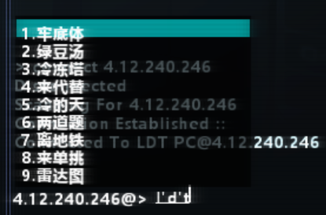

# HacknetIME

> **快速导航**： [中文版本](#中文版本) | [English Version](#english-version)

## 中文版本

HacknetIME 是一款 **Hacknet** 的 **Pathfinder / BepInEx 全局插件**，为游戏终端提供**原生中文输入法支持**。

本模组功能来自 [KernelFix (KF)](https://github.com/LDTchara/KernelFix)，分离为独立模组后增加了：
- Linux / macOS 兼容
- BepInEx 颜色配置（候选框背景、文字、高亮）
- 组合文本末尾的第二闪烁光标
- 裸文本宽度测量（候选框宽度不再随序号位数跳变）

### ✨ 功能简介

#### ⌨️ 中文输入法

- 通过 **ImeSharp** 接入 Windows **TSF (Text Services Framework)**；Linux / macOS 通过 SDL 文字事件使用系统原生输入法。
- **组合文本（拼音/字母）直接显示在终端光标处**，带有白色字体和下划线。
- **候选词列表以半透明面板自绘在终端左下角**，支持长词自动适应宽度。
- 使用 **数字键 1‑9** 或 **空格键** 选词上屏，`↑` / `↓` 切换候选高亮。



#### 🎨 颜色配置

可通过 `BepInEx/config/com.LDTchara.HacknetIME.cfg` 自定义候选框外观：

```ini
## Settings file was created by plugin HacknetIME vX.X.X
## Plugin GUID: com.LDTchara.HacknetIME

[Visual]

## Debug logging / 调试日志
# Setting type: Boolean
# Default value: false
Debug = false

## Background color #AARRGGBB / 候选框背景色
# Setting type: String
# Default value: #B4000000
CandBgColor = #B4000000

## Selected text color #AARRGGBB / 选中项文字色
# Setting type: String
# Default value: #FFFFFFFF
CandSelTextColor = #FFFFFFFF

## Selected highlight color #AARRGGBB / 选中项背景色
# Setting type: String
# Default value: #80007070
CandSelBgColor = #80007070

## Default text color #AARRGGBB / 未选中文字色
# Setting type: String
# Default value: #FFFFFFFF
CandTextColor = #FFFFFFFF
```

#### 🖱️ 组合文本光标

- 组合输入阶段用 Prefix 完整替代 `doTerminalTextField`，隐藏原版终端光标。
- 在组合文本末尾绘制第二闪烁光标（`Math.Sin` 闪烁，6Hz），位置与字体对齐同步变化。

### 📦 安装方法

1. 确保已安装 **Pathfinder** 框架（它自带了 BepInEx）。
2. 下载 `HacknetIME.dll`。
3. 将文件放入游戏目录下的 `BepInEx/plugins/` 文件夹内。
4. 启动游戏，输入法即自动生效。

### ⚠️ 兼容性说明

- **本模组与 1.0.4 及之前版本的 KernelFix 功能重叠。若已在用旧版 KF，无需单独安装 HacknetIME。**（但还是建议装新版 KF）
- 本模组未包含 KernelFix 的其他修复（DPI 修正、OpenAL 兼容等）。如需这些功能，请补装 KernelFix。
- **与 [TAXCoreCNfix](https://github.com/Dsl114514/TAXCore-CN-fix) 不兼容**，两者同时加载会导致输入冲突。使用 HacknetIME 前请先移除 `TAXCoreCNfix`。
- 建议配合 **[HacknetFontReplace](https://github.com/fengxu-30338/HacknetFontReplace)**（或 UTF-16 修复版 [HacknetFontReplace_UTF16Fix](https://github.com/LDTchara/HacknetFontReplace_UTF16Fix)）使用，以解决部分汉字显示为 `?` 的问题。
- Linux / macOS 下 TSF 不可用，输入法通过 SDL 文字事件实现，候选框不显示（系统输入法自带候选界面）。

### 🔧 构建方法

```bash
dotnet build HacknetIME.csproj --nologo
```

输出：`bin/Debug/net472/HacknetIME.dll`（单个 DLL，Costura 嵌入 ImeSharp）。

---

## English Version

HacknetIME is a **Pathfinder / BepInEx global plugin** for **Hacknet** that adds **native IME input support** to the in-game terminal.

This mod is extracted from [KernelFix (KF)](https://github.com/LDTchara/KernelFix) as a standalone package with additional features:
- Linux / macOS compatibility
- BepInEx color configuration (candidate box background, text, highlight)
- Second blinking cursor at the end of composition text
- Bare-text width measurement (candidate box width no longer shifts as index digits change)

### ✨ Features

#### ⌨️ IME Text Input

- Uses **ImeSharp** for Windows **TSF (Text Services Framework)** support; Linux / macOS use system native IME via SDL text events.
- **Composition text (pinyin/letters) drawn inline at the terminal cursor** with white font and underline.
- **Candidate list drawn as a semi-transparent panel at the terminal's bottom-left corner**, with dynamic width for long words.
- Select with **1‑9 number keys** or **Space**, navigate with `↑` / `↓`.


#### 🎨 Color Configuration

Customize candidate box appearance via `BepInEx/config/com.LDTchara.HacknetIME.cfg`:

```ini
## Settings file was created by plugin HacknetIME vX.X.X
## Plugin GUID: com.LDTchara.HacknetIME

[Visual]

## Debug logging / 调试日志
# Setting type: Boolean
# Default value: false
Debug = false

## Background color #AARRGGBB / 候选框背景色
# Setting type: String
# Default value: #B4000000
CandBgColor = #B4000000

## Selected text color #AARRGGBB / 选中项文字色
# Setting type: String
# Default value: #FFFFFFFF
CandSelTextColor = #FFFFFFFF

## Selected highlight color #AARRGGBB / 选中项背景色
# Setting type: String
# Default value: #80007070
CandSelBgColor = #80007070

## Default text color #AARRGGBB / 未选中文字色
# Setting type: String
# Default value: #FFFFFFFF
CandTextColor = #FFFFFFFF
```

#### 🖱️ Composition Cursor

- A Prefix on `doTerminalTextField` fully replaces the method during composition, hiding the original terminal cursor.
- A **second blinking cursor** is drawn at the end of the composition text (`Math.Sin` blink at 6Hz), tracking font alignment changes.

### 📦 Installation

1. Make sure **Pathfinder** is installed (it bundles BepInEx).
2. Download `HacknetIME.dll`.
3. Place it in the game's `BepInEx/plugins/` folder.
4. Launch the game — IME works automatically.

### ⚠️ Compatibility

- **This mod overlaps with KernelFix (KF) v1.0.4 and earlier's IME functionality. If KF is already installed, HacknetIME is not required.** (Updating to the latest KF is still recommended.)
- Does not include KF's other fixes (DPI, OpenAL, etc.). Install KF alongside if you need those.
- **Incompatible with [TAXCoreCNfix](https://github.com/Dsl114514/TAXCore-CN-fix)** — running both causes input conflicts. Remove `TAXCoreCNfix` before installing HacknetIME.
- Recommended to use with **[HacknetFontReplace](https://github.com/fengxu-30338/HacknetFontReplace)** (or the UTF-16 fixed fork [HacknetFontReplace_UTF16Fix](https://github.com/LDTchara/HacknetFontReplace_UTF16Fix)) to resolve missing glyphs (`?` placeholders).
- On Linux / macOS, TSF is unavailable; input uses SDL text events. The candidate box is not rendered (the system IME provides its own candidate window).

### 🔧 Building

```bash
dotnet build HacknetIME.csproj --nologo
```

Output: `bin/Debug/net472/HacknetIME.dll` (single DLL, ImeSharp embedded via Costura).

---

**License**: MIT — see [LICENSE](LICENSE).
